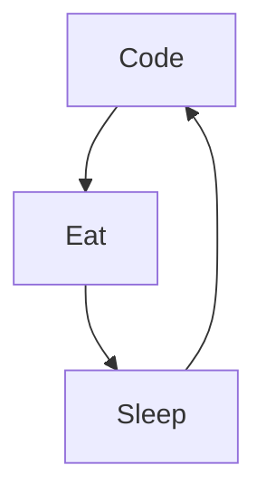

### Hi there 👋

# Baban Dev

Développeur intégrateur web passionné par React, spécialisé dans la création d'expériences digitales innovantes. Fort d'une expertise en HTML, CSS et JavaScript, avec une volonté constante d'apprentissage et de collaboration. Rejoignez-moi dans la construction de projets web fascinants ! 🚀💻 #ReactJS #FrontEnd #DéveloppementWeb

<!--
**Babanlpz/Babanlpz** is a ✨ _special_ ✨ repository because its `README.md` (this file) appears on your GitHub profile.

Actuellement:

- 🔭 Je travaille actuellement sur mon portfolio pour trouver des contrats de freelance.
- 🌱 J'apprends actuellement ReactJS, Tailwind CSS, Firebase et Next.js.
- 👯 Je cherche à collaborer sur des projets qui me permettront de progresser et d'évoluer professionnellement.
- 💬 Posez-moi des questions sur LinkedIn.
- 📫 Comment me contacter : Vous pouvez me contacter via LinkedIn ou par email à l'adresse babanlopezdev@gmail.com.
-->

### Connect with me:

&nbsp;&nbsp;

&nbsp;&nbsp;

### Languages and Tools:

 
 

### My daily routine :

[website]: https://portfoliobaban.vercel.app/
[insta]: https://www.instagram.com/babanlpz/
